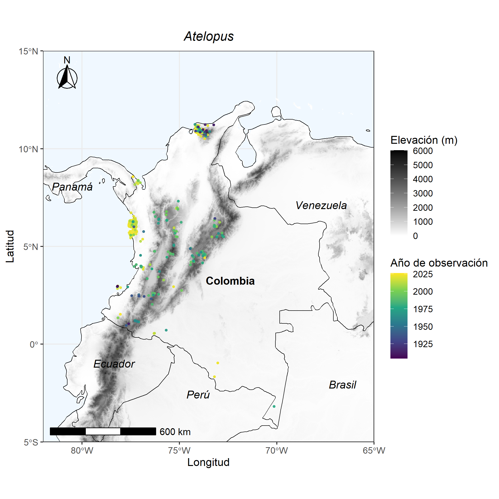

# Mapa de distribución del género *Atelopus*

**Figura 1.** Distribución espacial y temporal de los registros de presencia del género Atelopus (Anura: Bufonidae) en Colombia (1904-2026). Distribución geográfica de los registros históricos y contemporáneos documentados sobre la topografía nacional, incluyendo áreas insulares. La gradación de color en los puntos indica el año de observación, abarcando desde registros históricos (azul oscuro, ~1904) hasta observaciones recientes (amarillo, ~2026). El mapa base representa el modelo digital de la elevación en escala de grises (0 a 6000 metros sobre el nivel del mar), distinguiendo las áreas de baja altitud (tonos claros) de las zonas de alta montaña (tonos oscuros). Los datos evidencian una concentración de observaciones a lo largo de las Cordilleras Occidental y Central, el Chocó biogeográfico y la Sierra Nevada de Santa Marta, observándose una distribución relativamente continua de registros históricos y recientes en estas regiones. Datos de ocurrencia obtenidos a partir del portal GBIF (Global Biodiversity Information Facility); mapa elaborado mediante R bajo el sistema de referencia de coordenadas WGS84 (EPSG:4326). 

**Fuente de datos**
GBIF.org. (2026). GBIF Occurrence Data: Atelopus in Colombia. Global Biodiversity Information Facility. Disponible en: https://www.gbif.org [Accedido en septiembre de 2026]. 

> Los datos fueron descargados utilizando [Descargar_abundancias.ipynb](Descargar_abundancias.ipynb))

> El mapa fue generado utilizando [Script_Atelopus.R](Script_Atelopus.R)
